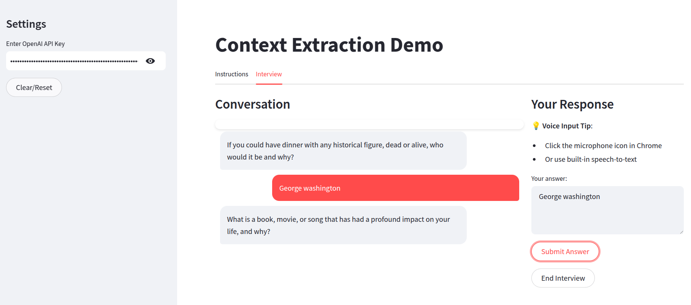
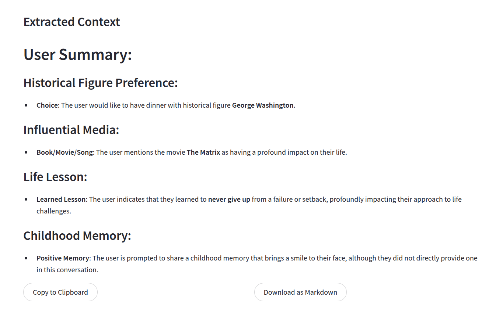
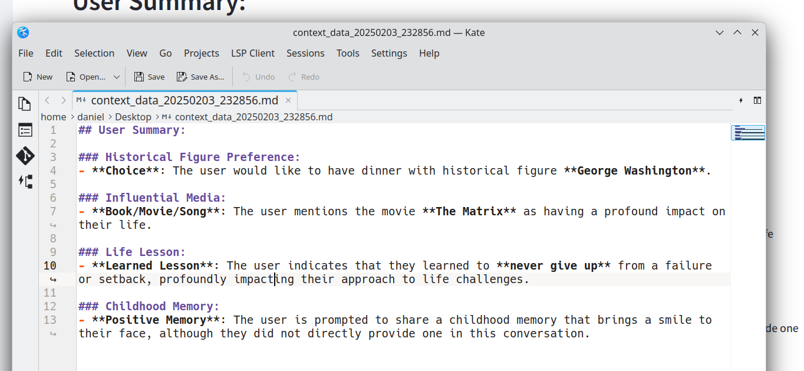

# Context Extraction Demo

This project demonstrates an innovative approach to enhancing personalized Large Language Model (LLM) experiences through agentic workflow-based context extraction. The system showcases how AI agents can proactively generate and collect contextual data to improve the quality and relevance of LLM interactions.

## Purpose

The primary goal of this project is to illustrate how an agent-driven workflow can:
- Proactively identify and extract relevant contextual information
- Generate meaningful data that enhances LLM understanding
- Create more personalized and context-aware AI interactions
- Demonstrate practical implementation of agentic workflows in LLM systems

## Screenshots

## About

This project was developed through collaboration between [Daniel Rosehill](https://danielrosehill.com) and Claude (Anthropic). It serves as a practical demonstration of how AI systems can be designed to actively participate in context generation and enhancement, leading to more effective and personalized LLM experiences.

## Implementation

The system implements an agentic workflow that enables:
- Automated context extraction from user interactions
- Proactive generation of contextual metadata
- Integration of extracted context into LLM inference processes
- Enhanced personalization through accumulated contextual understanding

## Attribution

Development: Claude (Anthropic)
Project Direction and Implementation: Daniel Rosehill
