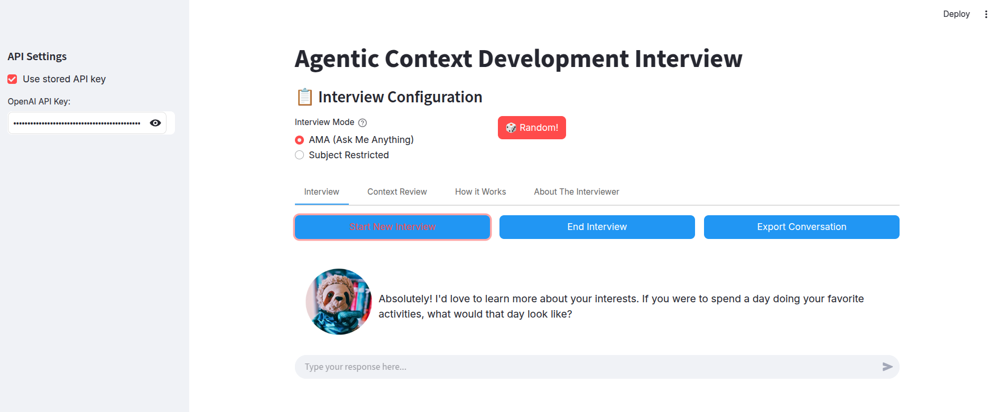
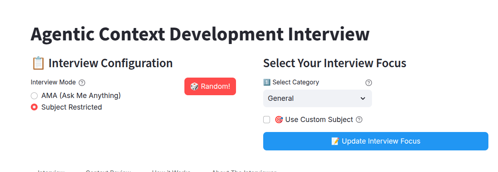
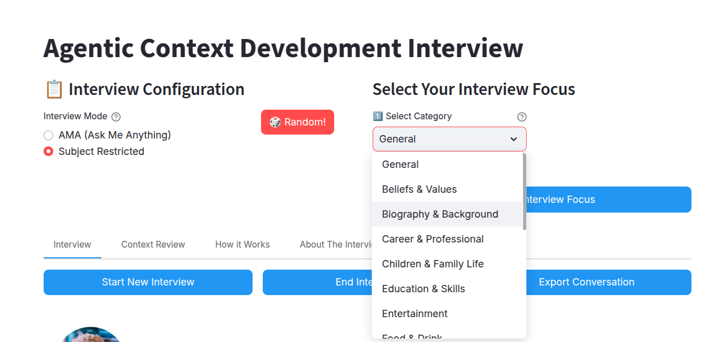

# Context Extraction Demo

This project demonstrates an innovative approach to enhancing personalized Large Language Model (LLM) experiences through agentic workflow-based context extraction. The system showcases how AI agents can proactively generate and collect contextual data to improve the quality and relevance of LLM interactions.

## Purpose

The primary goal of this project is to demonstrate how an agent-driven workflow can proactively build your personal context vault - a system-agnostic collection of contextual data that enhances AI interactions. The system:
- Proactively identifies and extracts relevant contextual information through natural conversation
- Generates structured, portable context data that can be used across different AI platforms
- Creates more personalized and context-aware AI interactions
- Demonstrates practical implementation of agentic workflows in LLM systems

## Use Cases

### Primary Use Case: Personal RAG Pipeline
- **Build Your Context Vault**: Progressively build a rich collection of personal context through natural conversations
- **System Agnostic**: Generated context is stored in portable markdown format, allowing integration with any vector database
- **Flexible Integration**: Use with any RAG system - from local setups (like LlamaIndex) to cloud platforms (like Pinecone)
- **Iterative Enhancement**: Regularly conduct new interviews to expand your context vault with fresh insights

### Additional Use Cases
- **Personal AI Assistant Training**: Feed context into AI assistants for more personalized interactions
- **Knowledge Base Building**: Create structured documentation of personal or professional expertise
- **Team Onboarding**: Generate context about team members' backgrounds and expertise
- **User Research**: Conduct and analyze in-depth interviews with structured context extraction

### Integration Examples
- Load context into Pinecone for enterprise-grade vector search
- Use with ChromaDB for local-first personal AI applications
- Import into LlamaIndex for building personal knowledge graphs
- Feed into custom RAG pipelines using frameworks like LangChain

## Screenshots

### Step 1: AI agent asks you questions according to your preferred area of focus

 

### Step 2: Sit back and talk about yourself for a while

The bot asked me if I could wake up with one magic power in the morning what would it be? This is the SFW version:

 

### When you're done, click on 'End Interview' and your interview with the bot is done:
 
 

### The chat transcript is then parsed, mined for contextual data, and reformatted for ingress to a RAG pipeline / vector DB

(Behind the scenes)

### You get your context data out the other end!

 
### Download and load into an agent for personalised LLM!

The reformatted contextual data snippets from the interviews are provided as downloadable markdown files. Markdown was chosen for its compact nature, its versatility, and its ubiquitous presence in the world of large language models. 

These marked on files can then be aggregated, uploaded, or added to a RAG pipeline and added to an agent for personalized large language model (LLM) experiences. 

An iterative workflow is envisioned whereby the user engages in a few interviews at a time, feeding these into vector database storage and progressively increasing the pool of personal context data available to the tools being worked with. 
 
## About

This project was developed through collaboration between [Daniel Rosehill](https://danielrosehill.com) and Claude (Anthropic). It serves as a practical demonstration of how AI systems can be designed to actively participate in context generation and enhancement, leading to more effective and personalized LLM experiences.

## Implementation

The system is built using Streamlit and implements a sophisticated agentic workflow that includes:

### Core Features
- **Interactive Interview System**: AI-driven conversational interface that conducts dynamic interviews using OpenAI's API
- **Contextual Question Generation**: Automatically generates relevant follow-up questions based on previous responses
- **API Key Management**: Secure storage and management of OpenAI API keys with local configuration
- **Session Management**: Robust handling of interview sessions with state preservation
- **Context Extraction**: Automated extraction of meaningful context from conversations using LLM processing

### Technical Components
- **Frontend**: Built with Streamlit for a responsive and user-friendly interface
- **Backend Processing**:
  - OpenAI API integration for intelligent question generation
  - Context extraction pipeline for processing interview data
  - Local storage system for API keys and session data
- **Data Export**: Automated generation of markdown files containing extracted context
- **Security**: Secure handling of API keys with local encryption

### User Experience Features
- Real-time chat interface with message history
- Progress tracking for interview sessions
- Downloadable context data in markdown format
- Persistent API key storage option
- Error handling and user feedback

### Integration Capabilities
- Generated context data is formatted for direct integration with:
  - Any vector database (Pinecone, ChromaDB, Weaviate, etc.)
  - RAG (Retrieval-Augmented Generation) pipelines
  - LLM fine-tuning datasets
  - Personal AI agents and assistants
- Decoupled Architecture:
  - Context storage is independent of any specific AI platform
  - Portable markdown format ensures long-term accessibility
  - Easy migration between different vector databases
  - Future-proof your personal context vault

## Attribution

Development: Claude (Anthropic)
Project Direction and Implementation: Daniel Rosehill
